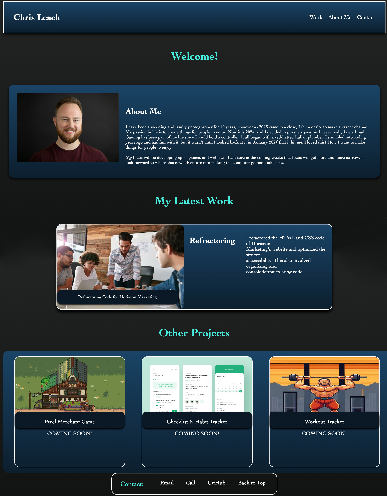

# <My Portfolio>

## Description

My goal with this project was to use what I know of HTML and CSS to build my starting portfolio as a developer. I wanted my project to display in a crisp and clean fashion while also adapting to different screen sizes. I learned a great deal about media queries and flex properties for CSS. Overall I am pleased with the result!

## Deployed Application

https://chrisvulpine.github.io/my-portfolio/

## Credits

### Images

* Sun Haven Pixel Art Game - 
https://www.pinterest.com/pin/599612137883743782/

* Horiseon image - Challenge 1 assets - https://github.com/coding-boot-camp/urban-octo-telegram

* To Do List App image - https://dribbble.com/shots/14848933-Rengse-To-Do-List-App-Design

* Workout Tracker Image - AI generated from: https://perchance.org/ai-pixel-art-generator

### Code 

* Outerglow: https://unused-css.com/blog/css-outer-glow/

* Text Box Over image: https://www.w3schools.com/howto/howto_css_image_text_blocks.asp

* How to make link open in new tab: https://www.quora.com/How-do-you-make-a-link-open-in-a-new-tab-CSS#:~:text=But%20you%20want%20it%20to,URL%20with%20the%20href%20property

* Adding live email to footer: https://www.tutorialspoint.com/html/html_email_links.htm

* Typical screen sizes for Media Queries: chat.openai.com

### General Reference: 
* https://www.w3school.com
* https://www.youtube.com/@BroCodez